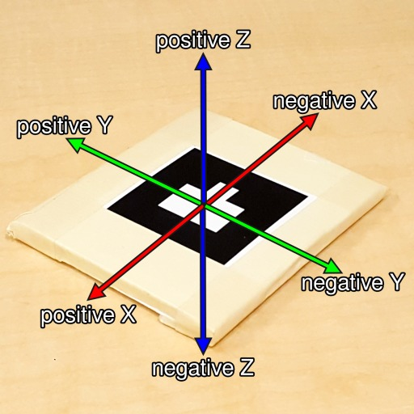

# HMD-Smart-Training

CIS 2 Projects 9 and 10

This is a fork of the original project which is optimized for the Microsoft HoloLens. The main changes include:

- Replaced ARToolKit with Long's ARToolKit for HoloLens implementation from https://github.com/qian256/HoloLensARToolKit
- Made UI work well with the different aspect ratio and resolution of the HoloLens
- Replaced Google Voice Recognition by Microsoft Keyword Recognition (works also offline!)
- JSON files for the workflows are now loaded from the folder User Files\LocalAppData\JuxtopiaHoloLens\RoamingState which is accesible from the HoloLens Device Portal.
  - This unfortunately has the drawback that the JSON files need to be manually copied to the HoloLens after the build
  - Files like images are still loaded from Assets\StreamingAssets\Resources
- Paths to JSON files are not hardcoded any more in the ReadWorkflow.cs script, but can be configured in the Unity scene 

## FeatureAnchoredObjects
FeatureAnchoredObjects are currently only implemented as "points". By setting the "Image_Path" in the JSON file to "point" green spheres with a radius of 5cm can be placed in relationship to the marker. Units are in meters.
Coordinate axes in relationship to an AR Marker are shown in the image.

## Voice commands
- **Next** advances to the next step
- **Previous** goes one step back
- **Switch** goes to the next procedure
- **Reload** loads the JSON file again but stays on the same step. Very useful for on the fly changes to the JSON
- **Start over** loads the JSON file again but starts over at step 1
- **Hide** hides all the overlays
- **Show** shows all the overlays